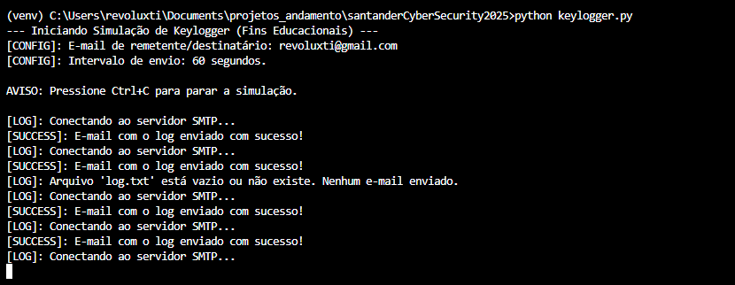
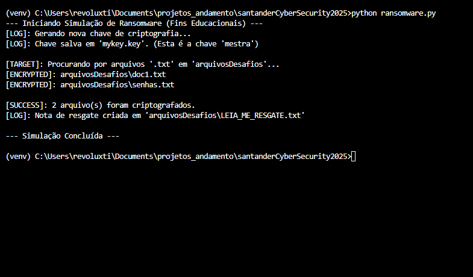
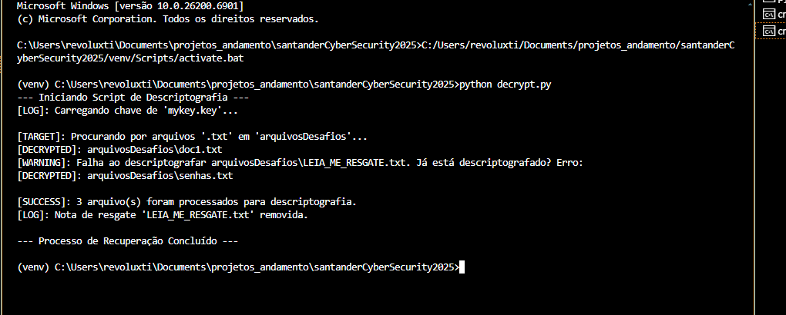
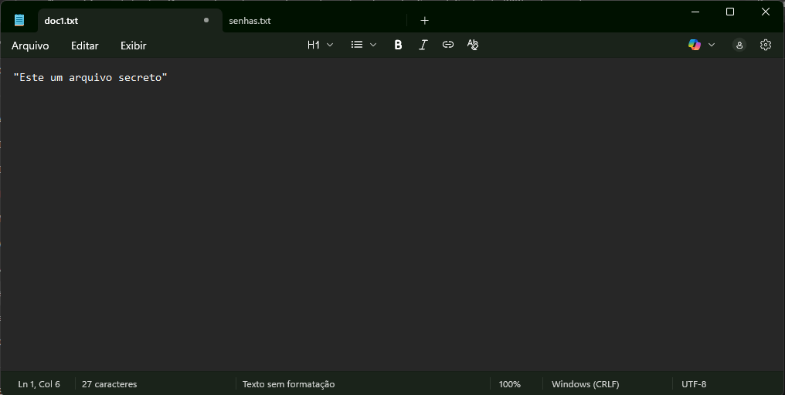
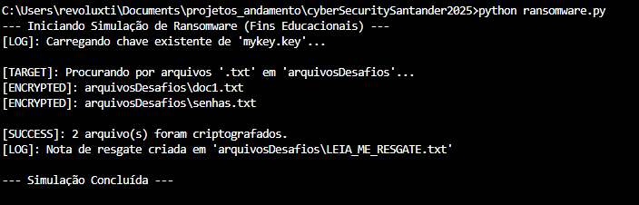
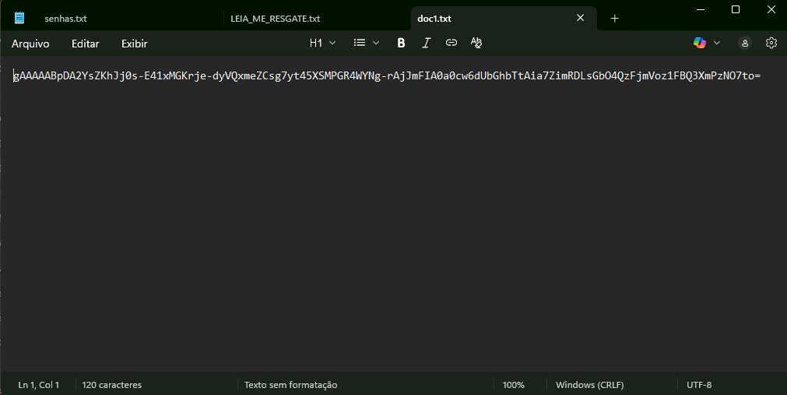
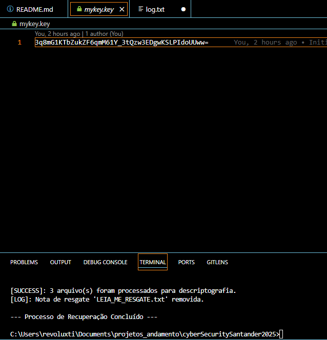
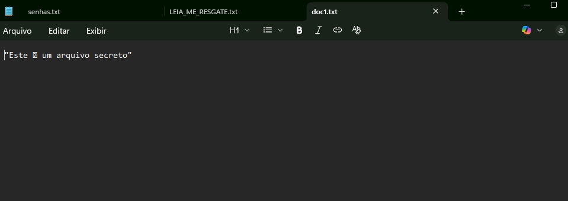

<p align="center">
  
</p>

<h1 align="center">Santander Cybersecurity 2025 - Desafio Final</h1>

<p align="center">
  <strong>Projeto Prático: Simulação Educacional de Ransomware e Keylogger</strong>
  <br>
  Desenvolvido por: <strong>Revoluxti (Seu Nome)</strong>
</p>

<p align="center">
  
  
  
  <a href="https://github.com/[SEU-USUARIO]/[SEU-REPOSITORIO]/blob/main/LICENSE">
    
  </a>
</p>

> **ALERTA DE SEGURANÇA:** Este repositório contém scripts para fins **estritamente educacionais** como parte do Santander Cybersecurity 2025. O objetivo é compreender o funcionamento de malwares para construir defesas mais eficazes. **Não execute estes scripts fora de um ambiente controlado e isolado.**

---

## Sumário

* [1. Visão Geral do Projeto](#1-visão-geral-do-projeto)
* [2. Objetivos de Aprendizagem](#2-objetivos-de-aprendizagem)
* [3. Arquitetura do Projeto](#3-arquitetura-do-projeto)
* [4. Tecnologias Utilizadas](#4-tecnologias-utilizadas)
* [5. Guia de Instalação e Execução](#5-guia-de-instalação-e-execução)
* [6. Demonstração (Capturas de Tela)](#6-demonstração-capturas-de-tela)
  * [6.1. Keylogger em Ação](#61-keylogger-em-ação)
  * [6.2. Ransomware em Ação](#62-ransomware-em-ação)
* [7. 🛡️ Análise Didática: A Mentalidade de Defesa (Blue Team)](#7-🛡️-análise-didática-a-mentalidade-de-defesa-blue-team)
  * [7.1. Didática do Keylogger](#71-didática-do-keylogger)
  * [7.2. Didática do Ransomware](#72-didática-do-ransomware)
  * [7.3. A Defesa na Estrutura do Projeto](#73-a-defesa-na-estrutura-do-projeto)
* [8. Autor](#8-autor)

---

## 1. Visão Geral do Projeto

Este projeto é a entrega final do desafio de cibersegurança do Santander. Ele consiste na implementação em Python de dois malwares simulados, executados em um ambiente seguro:

1.  **Keylogger (`malware_sim.py keylogger`):** Um script que captura todas as teclas digitadas, salva-as em um arquivo de log (`log.txt`) e, periodicamente, envia esse log para um e-mail pré-configurado.
2.  **Ransomware (`malware_sim.py encrypt` / `decrypt`):** Um par de scripts que simula um ataque de ransomware.
    * `encrypt`: Gera uma chave de criptografia, localiza arquivos-alvo (apenas `.txt` na pasta segura `arquivosDesafios`) e os criptografa.
    * `decrypt`: Utiliza a chave gerada para reverter o processo e "resgatar" os arquivos.

O foco principal não está no ataque (Red Team), mas na **documentação** e **reflexão defensiva** (Blue Team) sobre como esses ataques funcionam e como podemos nos proteger.

## 2. Objetivos de Aprendizagem

* **Compreender na prática** o funcionamento de um Keylogger (hooks de teclado, exfiltração de dados) e Ransomware (criptografia simétrica).
* **Identificar vulnerabilidades** exploradas, com foco principal no fator humano.
* **Programar em Python** para simular ameaças reais em um ambiente controlado.
* **Documentar** experimentos e utilizar o **GitHub** como portfólio técnico.
* **Refletir e propor** estratégias de **Prevenção, Detecção e Resposta** a incidentes.

## 3. Arquitetura do Projeto

A estrutura de arquivos foi organizada para demonstrar profissionalismo e boas práticas de desenvolvimento seguro, separando código, assets, segredos e arquivos de teste.

## 4. Tecnologias Utilizadas

* **Python 3.10+**
* **Bibliotecas Python:**
    * `argparse`: Para criar a interface de linha de comando (CLI) do script unificado.
    * `pynput`: Para criar o listener global de teclado (`keylogger`).
    * `python-dotenv`: Para carregar segredos (e-mail, senha) do arquivo `.env` de forma segura.
    * `smtplib`: Para enviar os logs por e-mail (exfiltração de dados).
    * `threading`: Para permitir que o keylogger envie e-mails em background sem travar a captura de teclas.
    * `cryptography` (Fernet): Para a criptografia simétrica robusta no `ransomware`.

## 5. Guia de Instalação e Execução

**Aviso: Execute apenas em um ambiente controlado (ex: Máquina Virtual).**

1.  **Clonar o Repositório:**
    ```bash
    git clone [https://github.com/](https://github.com/)[SEU-USUARIO]/[SEU-REPOSITORIO].git
    cd [NOME-DO-SEU-REPOSITORIO]
    ```

2.  **Criar e Ativar o Ambiente Virtual:**
    ```bash
    # Windows
    python -m venv venv
    .\venv\Scripts\activate
    
    # Linux / macOS
    python3 -m venv venv
    source venv/bin/activate
    ```

3.  **Instalar Dependências:**
    ```bash
    pip install -r requirements.txt
    ```

4.  **Configurar Segredos (Keylogger):**
    Crie um arquivo chamado `.env` na raiz do projeto e preencha-o:

    ```.env
    EMAIL_ADDRESS="seu-email-de-envio@gmail.com"
    EMAIL_PASSWORD="sua-senha-de-app-do-google"
    ```
    > **Dica:** Lembre-se de usar "Senhas de App" do Google/Gmail se você tiver a autenticação de dois fatores (2FA) ativada.

5.  **Preparar o Ambiente (Ransomware):**
    Crie a pasta de testes e alguns arquivos de texto (o script só ataca `.txt`).
    ```bash
    mkdir arquivosDesafios
    echo "Este é um arquivo secreto" > ./arquivosDesafios/doc1.txt
    echo "Minha senha é 1234" > ./arquivosDesafios/senhas.txt
    ```

6.  **Executar as Simulações:**
    * **Para rodar o Keylogger:**
        ```bash
        python malware_sim.py keylogger
        ```
        *(Ele começará a capturar. Digite algo e aguarde o intervalo de 60s para o e-mail. Pressione `Ctrl+C` para parar).*

    * **Para rodar o Ransomware (Criptografar):**
        ```bash
        python malware_sim.py encrypt
        ```
        *(Verifique a pasta `arquivosDesafios` e a nota de resgate criada).*

    * **Para rodar o "Resgate" (Descriptografar):**
        ```bash
        python malware_sim.py decrypt
        ```
        *(Verifique a pasta `arquivosDesafios` novamente. Os arquivos devem estar legíveis).*

## 6. Demonstração (Capturas de Tela)

> 💡 **Instrução:** Verifique se os caminhos abaixo (ex: `./assets/demo_keylogger_1.png`) estão corretos e correspondem aos nomes dos seus arquivos.

### 6.1. Keylogger em Ação

1.  **Execução do Script:** O terminal mostra o script em modo de escuta e a confirmação de conexão SMTP.
    

2.  **Geração do Log Local:** O arquivo `log.txt` é preenchido com as teclas capturadas.
    

3.  **Exfiltração por E-mail:** O e-mail de "ataque" chega na caixa de entrada do destinatário.
    

### 6.2. Ransomware em Ação

1.  **Arquivos Originais:** A pasta `arquivosDesafios` antes do ataque.
    

2.  **Execução do `encrypt`:** O script confirma a geração da chave e a criptografia.
    

3.  **Arquivos Criptografados:** Os arquivos `.txt` agora estão com conteúdo ilegível.
    

4.  **Nota de Resgate:** O arquivo `LEIA_ME_RESGATE.txt` é criado na pasta.
    

5.  **Execução do `decrypt`:** O script de "resgate" é executado usando a `mykey.key`.
    

6.  **Arquivos Recuperados:** Os arquivos na pasta `arquivosDesafios` voltam ao seu estado original.
    


## 7. 🛡️ Análise Didática: A Mentalidade de Defesa (Blue Team)

Esta é a seção mais importante. O que aprendemos ao construir esses scripts?

### 7.1. Didática do Keylogger

* **O Ataque (Red Team):**
    * O script mostra como é simples usar `pynput` para capturar todas as entradas do teclado.
    * A exfiltração de dados é feita via `smtplib` (um protocolo legítimo) para "disfarçar" o tráfego como um e-mail comum.
    * O uso de `threading.Timer` mostra como um malware opera em background, executando tarefas (como enviar e-mails) sem que o usuário perceba.
    * **Ataque Real:** Um invasor tornaria o script "furtivo" renomeando-o para `.pyw` (no Windows) para executá-lo sem janela de console e o configuraria para iniciar com o sistema.

* **A Defesa (Blue Team):**
    * **Prevenção:** O vetor de entrada é quase sempre Engenharia Social (phishing). A conscientização do usuário é a principal defesa.
    * **Detecção (EDR):** Um software de Antivírus/EDR (Endpoint Detection and Response) moderno detectaria esse script não por sua assinatura, mas por seu **comportamento**: um processo desconhecido (ex: `python.exe`) registrando "hooks" de teclado globais.
    * **Detecção (Firewall):** Em um ambiente corporativo, um firewall de saída deveria bloquear conexões SMTP (porta 587/465) originadas de estações de trabalho. Apenas servidores de e-mail autorizados deveriam ter permissão para fazer isso.

### 7.2. Didática do Ransomware

* **O Ataque (Red Team):**
    * O script usa `cryptography.fernet` (Criptografia Simétrica), que é extremamente rápida e segura.
    * A "fraqueza" da nossa simulação é que a chave (`mykey.key`) é salva no mesmo disco. Isso torna a recuperação trivial (executando `decrypt`).
    * **Ataque Real:** Um ransomware real usa **Criptografia Assimétrica** (RSA). O script de ataque contém apenas a Chave Pública. Ele criptografa os arquivos de forma que apenas a Chave Privada (que está segura no servidor do invasor) pode descriptografá-los. Por isso é impossível "quebrar" a criptografia sem pagar.

* **A Defesa (Blue Team):**
    * **Detecção (EDR):** Assim como o keylogger, a detecção é comportamental. Um EDR identificaria um processo realizando operações de I/O (leitura/escrita) em massa em alta velocidade, lendo arquivos e reescrevendo-os. Isso é um padrão clássico de ransomware.
    * **Resposta a Incidente:** A primeira ação ao detectar um ransomware é **ISOLAR A MÁQUINA DA REDE** (desconectar o cabo/Wi-Fi) para impedir que ele se espalhe lateralmente para outros computadores ou servidores.
    * **Recuperação (A Única Defesa Real): BACKUPS!** Este exercício prova que, uma vez criptografado, o dado se foi. A única defesa 100% eficaz é ter uma política de backup robusta (ex: Regra 3-2-1), com cópias testadas e mantidas offline/imutáveis.

### 7.3. A Defesa na Estrutura do Projeto

* **`.gitignore`:** É uma ferramenta de segurança. Ele impede o envio acidental de arquivos sensíveis como `.env` (credenciais), `mykey.key` (chave de criptografia) e `log.txt` (dados capturados) para um repositório público.
* **`.env`:** Demonstra a prática de separar configuração de código. Senhas e segredos nunca devem ser "hardcoded" (escritos diretamente no script).
* **`argparse`:** Mostra uma organização de código profissional, separando as funcionalidades em módulos lógicos, facilitando a manutenção e o teste.

## 8. Autor

Projeto desenvolvido com dedicação para o desafio Santander Cybersecurity 2025.

<p>
  <strong>Revoluxti (Seu Nome)</strong>
  <br>
  <a href="https://linkedin.com/in/revoluxti">LinkedIn</a> | 
  <a href="https://github.com/revoluxti">GitHub</a>
</p>